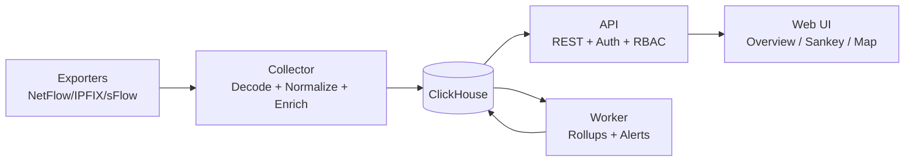

# FlowScope

[](LICENSE)
[](go.mod)
[](docker-compose.yml)
[](web)
[](deploy/clickhouse/init/001_schema.sql)

**Open-source self-hosted network flow observability platform for defensive teams.**  
**Open-source self-hosted платформа наблюдаемости сетевых потоков для defensive-команд.**

FlowScope turns exporter telemetry into operational insight: who talks to whom, over which ports/protocols, at what volume, and when behavior changes.  
FlowScope превращает телеметрию экспортеров в прикладную аналитику: кто с кем взаимодействует, по каким портам и протоколам, в каком объеме и когда поведение меняется.

## Why FlowScope / Зачем FlowScope

- NetFlow v5/v9, IPFIX, sFlow ingestion over UDP
- unified normalization and optional enrichment (inventory, GeoIP/ASN, rDNS, interface aliases)
- ClickHouse-backed raw + rollup analytics for fast historical queries
- analyst-first UX: Overview, Flows, Sankey, Interaction Map
- port-centric visual analytics (top destination ports + edge port distribution)
- drill-down path from graph edge to raw matching flows
- RBAC (`admin` / `viewer`) and optional OIDC SSO
- heuristic alerting rules/events and reusable saved views

## Capability Card / Карточка возможностей

| Capability | Status | Details |
|---|---|---|
| Flow ingestion (NetFlow/IPFIX/sFlow) | Ready | Multi-exporter UDP collection |
| Historical analytics (ClickHouse + rollups) | Ready | Raw + `1m/1h` query paths |
| Interaction map + drill-down | Ready | Node/edge details, ego isolate, grouping |
| Alert rules and events | Ready | Heuristic detections + manual evaluation |
| OIDC SSO | Beta | Optional via environment configuration |
| Multi-tenant isolation | Roadmap | Planned, not implemented |

Full matrix / Полная матрица: [docs/capability-matrix.md](docs/capability-matrix.md)

## Architecture / Архитектура



## Quick Start / Быстрый старт

1. Prerequisites / Требования
- Docker + Docker Compose v2
- free ports / свободные порты: `5173`, `8088`, `18123`, `19000`, `2055/udp`, `2056/udp`, `4739/udp`, `6343/udp`

2. Launch / Запуск

```bash
docker compose up --build -d
```

3. Health Check / Проверка

```bash
docker compose ps
curl http://localhost:8088/api/health
```

4. Open / Доступ
- Web UI: `http://localhost:5173`
- API: `http://localhost:8088`
- Demo credentials: `admin` / `admin123`

5. Shutdown / Остановка

```bash
docker compose down
# wipe data / удалить данные:
docker compose down -v
```

## OIDC SSO (Optional) / OIDC SSO (Опционально)

Set the following and rebuild `api` + `web`:

```env
FLOWSCOPE_OIDC_ENABLED=true
FLOWSCOPE_OIDC_ISSUER_URL=...
FLOWSCOPE_OIDC_CLIENT_ID=...
FLOWSCOPE_OIDC_CLIENT_SECRET=...
FLOWSCOPE_OIDC_REDIRECT_URL=http://localhost:8088/api/auth/oidc/callback
FLOWSCOPE_OIDC_SUCCESS_REDIRECT=http://localhost:5173/oidc/callback
```

```bash
docker compose up --build -d api web
```

## Analyst Workflow / Рабочий сценарий аналитика

1. Start with `Overview` to detect high-volume or unusual communication.
2. Jump to `Interaction Map` and isolate the ego-network around a node.
3. Click an edge to inspect protocols and destination port distribution.
4. Drill into raw flows for validation, reporting, and incident notes.

## API Surface (MVP)

Auth:
- `POST /api/auth/login`
- `GET /api/auth/oidc/start`
- `GET /api/auth/oidc/callback`
- `GET /api/auth/me`

Flow data and aggregations:
- `GET /api/health`
- `GET /api/exporters`
- `GET /api/flows/active`
- `GET /api/flows/historical`
- `GET /api/flows/:id`
- `GET /api/talkers/top`
- `GET /api/protocols/top`
- `GET /api/interfaces/top`
- `GET /api/ports/top`
- `GET /api/sankey`

Interaction map and drill-down:
- `GET /api/map/graph`
- `GET /api/map/node/:id`
- `GET /api/map/edge/:id`

Alerts and saved views:
- `GET /api/alerts/rules`
- `POST /api/alerts/rules`
- `PUT /api/alerts/rules/:id`
- `DELETE /api/alerts/rules/:id`
- `GET /api/alerts/events`
- `POST /api/alerts/evaluate`
- `GET /api/views`
- `POST /api/views`
- `PUT /api/views/:id`
- `DELETE /api/views/:id`

Utility:
- `GET /api/search`
- `POST /api/inventory/import`

## Repository Layout / Структура репозитория

```text
cmd/
  api/         REST API server
  collector/   UDP flow ingestion
  worker/      rollups and alert evaluation
  flowgen/     synthetic flow generator
  seed/        deterministic demo seed loader
internal/
  api/ auth/ config/ decoder/ enrich/ graph/ inventory/ model/ normalize/ rollup/ storage/
web/           React + TypeScript + Vite frontend
deploy/        Dockerfiles, ClickHouse schema init, seed fixtures
docs/          architecture, operations, API, security, runbooks
```

## Production Notes / Продакшн рекомендации

- rotate default admin credentials and JWT secret before public exposure
- publish only required ports and isolate ClickHouse in a private network segment
- place API and UI behind TLS reverse proxy with access controls
- configure backup and restore for ClickHouse volumes and audit log retention
- follow [SECURITY.md](SECURITY.md) for hardening baseline

## Documentation / Документация

- [Docs index](docs/index.md)
- [Wiki source pages / Исходники Wiki](docs/wiki/Home.md)
- [Quick start](docs/01-quickstart-ru.md)
- [Web UI user guide](docs/02-user-guide-web-ru.md)
- [Admin operations](docs/03-admin-operations-ru.md)
- [API reference](docs/04-api-reference-ru.md)
- [Configuration reference](docs/05-configuration-reference-ru.md)
- [Troubleshooting](docs/06-troubleshooting-ru.md)
- [Security and hardening](docs/07-security-and-hardening-ru.md)
- [Backup and restore](docs/08-backup-restore-ru.md)
- [Development guide](docs/09-development-ru.md)
- [Licensing](docs/10-licensing-ru.md)
- [Architecture notes](docs/architecture.md)
- [Interaction map behavior](docs/interaction-map.md)
- [Capability matrix](docs/capability-matrix.md)
- [GitHub presentation kit](docs/github-presentation-ru.md)

## GitHub Wiki

If your repository Wiki page still shows the default `Welcome to the ... wiki!`, enable Wiki in repository settings and push these pages from `docs/wiki/`.  
Если в Wiki пока видна стандартная страница `Welcome to the ... wiki!`, включите Wiki в настройках репозитория и опубликуйте страницы из `docs/wiki/`.

Manual publish from local machine:

```bash
powershell -ExecutionPolicy Bypass -File scripts/publish-wiki.ps1
```

For private repositories, use `GITHUB_TOKEN` (or pass `-Token`):

```bash
$env:GITHUB_TOKEN="ghp_xxx"
powershell -ExecutionPolicy Bypass -File scripts/publish-wiki.ps1
```

Or enable automatic sync via GitHub Actions workflow:
- `.github/workflows/wiki-sync.yml`

## Contributing

See [CONTRIBUTING.md](CONTRIBUTING.md).

## License

GNU AGPL v3.0 or later (`AGPL-3.0-or-later`). See [LICENSE](LICENSE) and [NOTICE](NOTICE).
